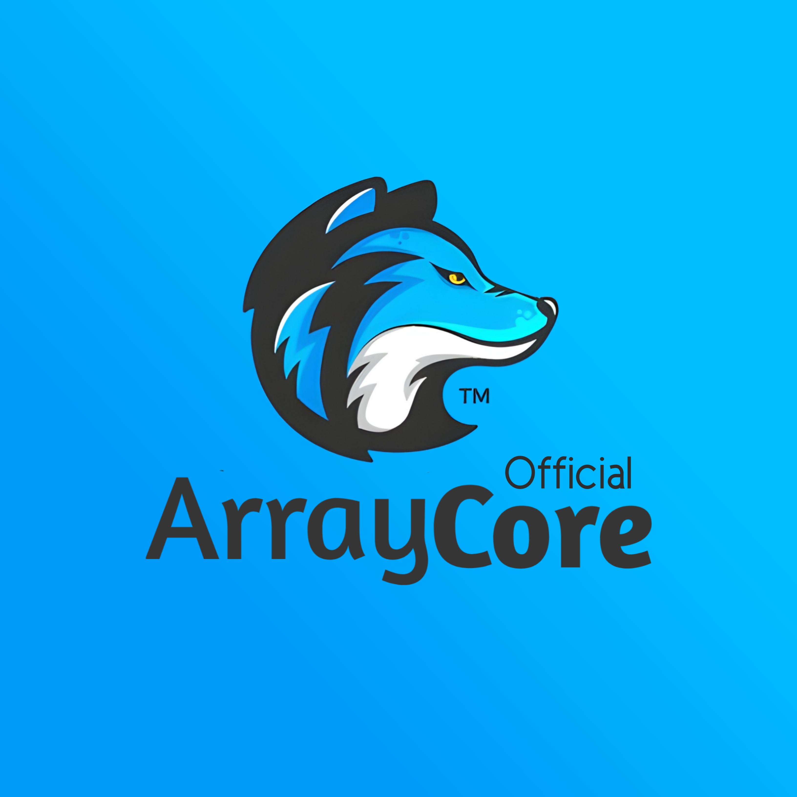

<p align="center">
  
</p>
<h1 align="center">
  <b>• ArrayCore •</b>
</h1>

## VPS Deployment
```sh
- sudo apt update && upgrade -y
- sudo apt install python3-pip -y virtualenv
- sudo apt install ffmpeg -y
- nvm install v16.5.0
- npm i -g npm
- bash Local.sh
- nano .env #Fill it with your variables value.
- python3 -m ArrayCore
```
